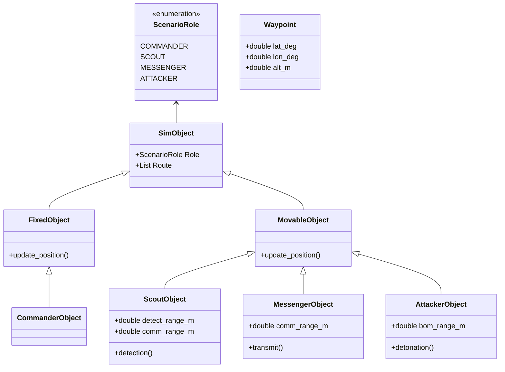

```mermaid
classDiagram
    SimObject <|-- FixedObject
    SimObject <|-- MovableObject
    SimObject : +ScenarioRole Role
    SimObject : +List<Waypoint> Route
    ScenarioRole <-- SimObject

    FixedObject <|-- CommanderObject
    MovableObject <|-- ScoutObject
    MovableObject <|-- MessengerObject
    MovableObject <|-- AttackerObject

    class ScenarioRole{
        <<enumeration>>
        COMMANDER
        SCOUT
        MESSENGER
        ATTACKER
    }

    class FixedObject{
        +update_position()
    }
    class MovableObject{
        +update_position()
    }
    class CommanderObject{
        
    }
    class ScoutObject {
        +double detect_range_m 
        +double comm_range_m
        +detection()
    }
    class MessengerObject {
        +double comm_range_m
        +transmit()
    }

    class AttackerObject {
        +double bom_range_m
        +detonation()
    }

    class Waypoint{
        +double lat_deg
        +double lon_deg
        +double alt_m
    }
```